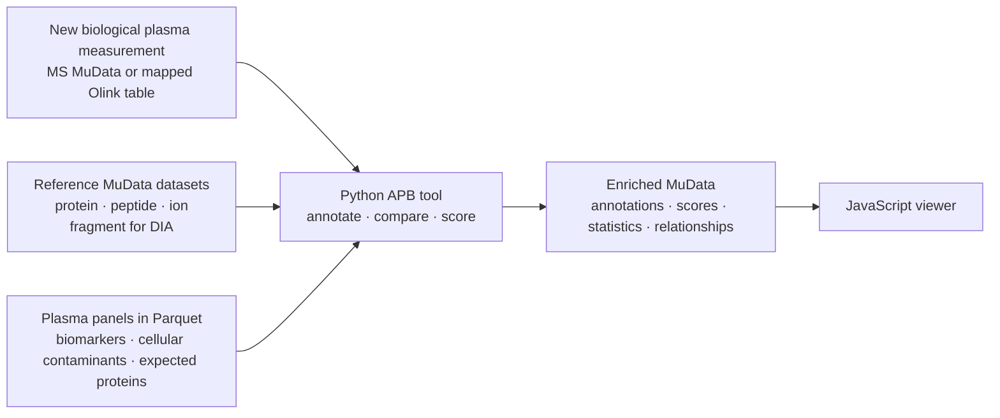

# EuBIC-MS Hackathon 2027 — proposal, paste-ready

> Paste each block into the matching field of the **Hackathon Proposals** discussion template at
> <https://github.com/EuBIC/EuBIC2027/discussions/new?category=hackathon-proposals>.
>
> Public project plan, datasets, panels, and references:
> <https://github.com/anndata-omics-bridge/apb-plasma>.

---

## Title

Quality control of biological plasma samples and their MS or Olink measurements with APB

---

## Abstract

[The AnnData Proteomics Bridge (APB)](https://github.com/anndata-omics-bridge) converts
quantitative-proteomics output tables into structured datasets. It preserves tool-specific columns
and links protein-, peptide-, and ion-level evidence; for DIA, it also links fragments. APB stores
data as AnnData/MuData, Parquet, or DuckDB. APB grew from ProteoBench's need to compare results from
several quantification tools. APB enriches MuData. `apb fasta` adds FASTA annotations;
`apb proteobench` adds feature-level statistics and dataset-level scores. APB joins related datasets
or data levels in multimodal containers.

Participants will extend APB to assess studies containing hundreds of biological plasma samples. We
will examine pre-analytical and biological sample-quality signals, cellular contamination,
expected-protein coverage, marker precision, abundance dynamic range, batch-associated shifts, and
agreement with reference datasets.

Participants will define, implement, and visualise candidate quality measures. Documented panels
will provide starting points. [Geyer et al. (2019)](https://doi.org/10.15252/emmm.201910427) used
counted dilution series to identify erythrocyte and platelet contamination markers. In collaboration
with the [Olink/proteoform project](https://github.com/EuBIC/EuBIC2027/discussions/11), participants
will test protein-level measures on a second modality and distinguish shared from platform-specific
measures. Contributors can access the prepared APB datasets from Python, R, Julia, or JavaScript to
calculate measures or build visualisations.

## Project Plan

**Before the event**, the organisers will quantify representative label-free DDA and DIA plasma
datasets with FragPipe and DIA-NN. They will use APB to convert the resulting tables into MuData.
They will also prepare a small fixture, reference MuData datasets, and plasma panels. Together with
the discussion 11 team, they will prepare either an accessible Olink dataset or an executable data
hand-off.

**During the four project days**, participants will:

1. define each quality measure's inputs, output, interpretation, data level, and validation dataset;
2. implement panel coverage, marker precision, and reference-dataset comparison;
3. define candidate cellular-contamination scores from documented panels and implement at least one
   for evaluation;
4. use APB to combine a new measurement, reference MuData datasets, and Parquet panels;
5. store the resulting annotations, scores, statistics, and relationships in an enriched MuData
   file;
6. evaluate each applicable core protein-level measure on at least two MS datasets and one Olink
   dataset;
7. record whether each measure requires a platform-specific interpretation; and
8. add one agreed quality-control visualisation using Vitessce, Plotly, or another JavaScript-based
   tool.

Participants can contribute plasma datasets, panels, metric definitions, implementations, or
visualisations.

**During and after the hackathon**, participants will document the metric definitions and validation
results. They will present the workflow and findings to the EuBIC-MS community. The team will publish
the software, panels, validation outputs, and enriched MuData examples in the
[`apb-plasma` repository](https://github.com/anndata-omics-bridge/apb-plasma). The team
will also prepare a manuscript about the cross-dataset and cross-modality evaluation.

## Technical Details

APB reads three Parquet panel types: plasma biomarkers, cellular contamination markers, and expected
plasma proteins. Reference MuData datasets link protein-, peptide-, and ion-level information; DIA
datasets may also link fragments. Each measure uses only its required matrices and annotations and
does not assume a common raw scale for MS and Olink. The enriched MuData exposes `layers`, `var`,
`varm`, `obs`, `obsm`, `obsp`, and `uns`. Participants can use Vitessce, Plotly, the APB object
explorer, or another JavaScript-based tool for visualisation.

APB does not yet convert metabolomics output. MetaboStats' Compound Discoverer
`.cdResult`/`.cdResultView` and MZmine `.mzmine` adapters provide a future AnnData migration path.

## Contact information

Witold E. Wolski — Functional Genomics Center Zurich (FGCZ), ETH Zurich / University of Zurich;
SIB Swiss Institute of Bioinformatics — witold.wolski@fgcz.uzh.ch

Sam van Puyenbroeck — CompOmics, VIB-UGent Center for Medical Biotechnology; Department of
Biomolecular Medicine, Ghent University — sam.vanpuyenbroeck@ugent.be

Tobias Kockmann — Functional Genomics Center Zurich (FGCZ), ETH Zurich / University of Zurich —
tobias.kockmann@fgcz.ethz.ch

