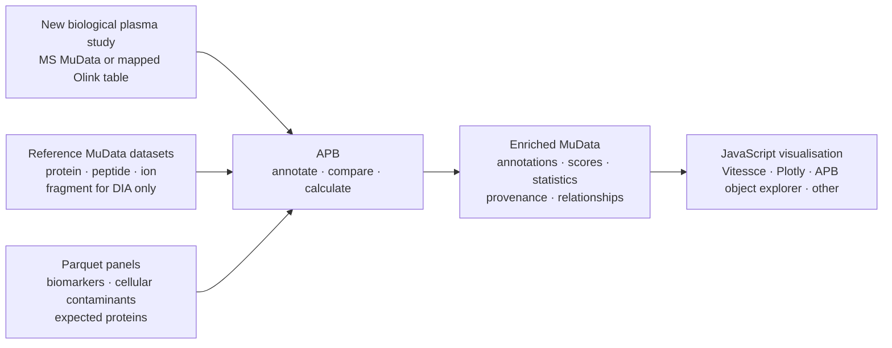

# EuBIC-MS Hackathon 2027 — APB plasma quality-control project

> **Status.** This document defines the scientific plan and four-day scope for an APB project
> proposed for the [EuBIC-MS Hackathon 2027](https://eubic-ms.org/events/hackathon-2027/).
>
> **Event:** 31 January–5 February 2027, with four project days at Gimo Herrgård, Sweden
> **Proposal deadline:** 1 September 2026
> **APB:** <https://github.com/anndata-omics-bridge>
> **Related Olink project:** <https://github.com/EuBIC/EuBIC2027/discussions/11>

## 1. Goal and scientific questions

The project will extend the AnnData Proteomics Bridge (APB) so researchers can assess studies that
contain hundreds of biological plasma samples. The project covers the biological samples and their
MS or Olink measurements. It asks five questions:

1. Do the samples show evidence of pre-analytical or biological sample-quality problems?
2. How strongly do cellular components contaminate the samples?
3. Do the measurements report the proteins expected for the study and assay?
4. How precisely does each platform quantify the expected proteins when the study design permits a
   precision estimate?
5. How do the study-level measurements compare with suitable reference datasets?

The first question concerns defined sample-quality problems rather than a general claim that a
sample is sound. [Geyer et al. (2019)](https://doi.org/10.15252/emmm.201910427) describe signals from
erythrocytes, platelets, and coagulation. [Korff et al. (2025)](https://doi.org/10.1038/s44321-025-00309-0)
examine how cellular contamination and pre-analytical conditions affect several plasma workflows.

The study scale matters. APB will calculate sample-level annotations and study-level summaries for
cohorts that may contain hundreds of biological samples. Pooled controls, technical replicates, and
instrument standards can support validation, but they are not the subject of the project.

When suitable controls and metadata exist, participants may also evaluate abundance dynamic range
and batch-associated structure. These are broader targets, not minimum deliverables.

### In scope during the four project days

- Define the inputs, output, interpretation, data level, and validation dataset for each quality
  measure.
- Implement panel coverage, marker precision, and reference-dataset comparison. Include an
  abundance-profile or rank-concordance candidate when a suitable reference exists. Define candidate
  cellular-contamination scores from documented panels and implement at least one for evaluation.
- Add the resulting annotations, scores, statistics, provenance, and relationships to MuData.
- Evaluate each applicable core protein-level measure on at least two MS plasma datasets and one
  mapped Olink plasma dataset.
- Record whether each tested measure transfers across modalities or needs a platform-specific
  interpretation.
- Add one agreed quality-control visualisation with Vitessce, Plotly, the APB object explorer, or
  another JavaScript-based tool.

### Outside the core scope

- Comparing FragPipe, DIA-NN, or other quantification tools.
- Converting a large corpus during the event. The organisers will prepare the main datasets before
  the event.
- Clinical diagnosis or patient-level prediction.
- Raw-file, chromatography, or instrument QC.
- A comprehensive proteomics QC standard, mzQC export, or controlled-vocabulary requests.
- TMT or SILAC. The prepared MS datasets use label-free DDA and DIA workflows.
- Fragment-level quality measures. APB may retain fragment-level evidence for DIA datasets, but the
  four-day project does not depend on implementing fragment measures.
- Automatic batch-effect correction or production of a corrected quantitative matrix.
- Migration of metabolomics converters into APB.

Participants can contribute plasma datasets, panels, quality-measure definitions, implementations,
or visualisations. New converters and additional downstream analyses remain possible post-hackathon
APB work; they are not part of this project's minimum outcome.

## 2. What APB contributes

[The AnnData Proteomics Bridge (APB)](https://github.com/anndata-omics-bridge) converts output tables
from quantitative-proteomics software into structured datasets. APB preserves tool-specific columns
instead of reducing every result to the columns shared by all tools. It links protein-, peptide-, and
ion-level evidence. For DIA data, APB can also link fragment-level evidence.

APB stores converted data as AnnData/MuData, Parquet, or DuckDB. AnnData and MuData provide the
exchange representation used in this project. Reference MuData datasets can hold linked information
at several data levels. Fragment-level information applies only to DIA reference datasets.

APB also enriches datasets:

- `apb fasta` adds FASTA-derived feature annotations.
- `apb proteobench` adds feature-level statistics and dataset-level ProteoBench scores to supported
  annotated datasets.
- Further APB operations can add annotations, quality measures, statistics, and relationships.
- APB can combine related datasets or data levels in multimodal MuData containers.

This convert–enrich–combine pattern defines the hackathon work. FragPipe and DIA-NN perform the
quantification before the event. APB converts their result tables. During the event, participants
will use APB to enrich the converted studies with panels, reference comparisons, and quality
measures.

The organisers will quantify every prepared MS dataset against the same versioned human sequence
database. They will record its source, release, and checksum. APB will retain each tool's original
protein-group identifier and all reported accession mappings. Participants will define how a
quality measure handles ambiguous protein groups; APB will not silently collapse them.

APB grew from ProteoBench's need to compare results from several quantification tools. The hackathon
uses `apb proteobench` as an enrichment example; it will not compare quantification software.

Contributors can access the prepared APB datasets from Python, R, Julia, or JavaScript. They can use
those datasets to define calculations, validate measures, or build visualisations. Each quality
measure uses only the matrices and annotations required for its calculation. The calculations
should not depend on the full AnnData or MuData API.

## 3. Inputs and enriched output

The workflow distinguishes three input classes.

### New biological plasma measurement

The main input is a study-level measurement:

- an MS MuData dataset prepared from FragPipe or DIA-NN output; or
- a mapped Olink table that retains the measured assay identifiers and assay metadata, adds protein
  mappings, and includes the sample and replication metadata required by the selected measures.

The study should retain sample metadata, quantitative values, feature identifiers, and the
tool-specific columns needed by the planned measures.

### Reference datasets

Reference datasets are MuData objects. Each prepared reference MuData dataset links protein-,
peptide-, and ion-level information. DIA reference datasets may also retain linked fragment-level
information. A reference dataset must document its source study, processing method, identifiers,
licence, and relevant experimental design.

### Annotation panels

Versioned Parquet tables hold three panel types:

1. plasma biomarkers;
2. cellular plasma-contamination markers; and
3. proteins expected in biological plasma samples.

Each row needs a stable protein identifier, the panel name, provenance, and enough information to
interpret directionality or weighting. A derivation method and licence statement accompany every
panel. Panel metadata must state its matrix, preparation or enrichment context, applicable modality
or assay, and evidence for expected detection.

### Output

APB combines the new measurement, reference MuData datasets, and Parquet panels. It produces an
enriched MuData artifact with:

- panel membership and feature annotations;
- sample-level and study-level quality results;
- reference-comparison statistics;
- provenance for every calculation;
- relationships between data levels and datasets; and
- the data required by the selected viewer visualisation.

## 4. Quality-measure definitions

Participants will specify the following contract for every quality measure:

| Field | Required information |
| --- | --- |
| Question | The scientific or technical question that the measure answers |
| Inputs | Exact matrix, annotations, metadata, panel, and reference values |
| Data level | Protein, peptide, ion, or DIA-only fragment information |
| Output | Scalar score, per-feature statistic, per-sample annotation, or study summary |
| Direction | Whether a larger value means more contamination, better coverage, or another stated effect |
| Validation | Dataset, expected behaviour, and comparison used to test the measure |
| Modality | Shared between MS and Olink, shared with different interpretation, MS-specific, or DIA-specific |
| Comparison scale | Normalisation or scale-free transformation selected for this measure, with its parameters and provenance |
| Feature identity | Original protein-group identifier, shared database release, member accessions, and mapping used for comparison |
| Study unit | Sample, plate, preparation batch, acquisition batch, or study |
| Study design | Biological covariates, technical factors, control material, and replicate structure needed for interpretation |
| Provenance | Code version, panel version, parameters, and source dataset |

### Core measure families

| Measure family | Core question | Minimum implementation | Important qualification |
| --- | --- | --- | --- |
| Cellular contamination | Do cellular components contribute an unexpected protein pattern? | Define candidate scores from an erythrocyte/haemolysis or platelet panel and implement at least one | The hackathon selects the score definition; the source panel does not prescribe it |
| Panel coverage | Does the measurement report the expected panel members? | Per-panel coverage and missing-member report | For Olink, separate assays absent from the Olink panel from assays targeted but not observed |
| Marker precision | How variable are the expected markers under repeated measurement? | A defined per-marker and panel summary | Participants must define the replicate structure, quantitative scale, and missing-value treatment before implementation |
| Reference comparison | How does the study compare with reference studies? | Per-marker and study-level comparison | Participants must define a documented normalisation or scale-free comparison; raw MS intensities and Olink values do not share a scale |

Reference comparison may include abundance-profile or rank-concordance measures. Participants may
compare each sample with repeated control plasma or with a documented external profile. They must
report proteins lost from and gained relative to the reference separately from the single-number
summary. The hackathon will evaluate candidate definitions; it will not prescribe Spearman,
weighted Jaccard, zero-filling, or another formula in advance. Rank concordance describes abundance
ordering and profile shape. It is not a measure of numerical dynamic range.

The four families are the target scope. The minimum floor is smaller and appears in Section 9.
Additional measures may use peptide or ion information when those levels add evidence.
Fragment-dependent measures are DIA-specific and remain future or stretch work.

### Broader target families

| Measure family | Question | Candidate implementation | Important qualification |
| --- | --- | --- | --- |
| Dynamic range | Does a sample's quantitative abundance spread differ from a suitable study or platform reference? | Define and evaluate a within-sample summary, such as an interquantile span on a documented log scale | Fix the data level, feature universe, normalisation, missing-value treatment, platform, and preparation context before comparison |
| Batch structure | Do quality results or abundance profiles shift with plate, preparation batch, acquisition batch, or run order? | Stratify the core measures by batch and evaluate supported control, distribution, missingness, similarity, and multivariate summaries | Association does not prove a technical cause; detection is separate from correction |

Participants will audit confounding between technical factors and available biological covariates
before interpreting a batch association. Repeated measurements of the same pooled plasma provide
direct technical evidence. Differences among unrelated biological samples require randomisation or
an analysis that accounts for the study design.

A batch report may include pooled-control completeness and precision, within- and between-batch
similarity, intensity distributions, relative-log-expression-style summaries, missingness by batch,
and PCA. PCA is a diagnostic view, not a batch score. When participants quantify batch association,
they will report effect sizes across several principal components that cover a declared fraction of
variance. They will not rely only on a PC1 significance test. The report must state whether it uses
complete features or imputation because batch-specific missingness can create apparent multivariate
structure.

Every batch comparison must use results from one common search. The same runs processed in
separate searches differ by search, transfer, inference, and normalisation context, which is not
a physical batch effect. Acquisition-order drift will be evaluated only when true chronological
timestamps or a global run order are available.

The hackathon will also leave the dynamic-range formula open for evaluation. An interquantile span
is one candidate, not a prescribed definition. Participants will not compare absolute MS and Olink
dynamic ranges: Olink's predefined targets and NPX scale require platform-specific interpretation.

## 5. Cellular-contamination and expected-protein panels

Biological plasma sample QC differs from the usual search-contaminant workflow. Keratin, trypsin,
BSA, and column-derived proteins are handling or process contaminants. Haemolysis, platelet
activation, and coagulation change the abundance of genuine human proteins in plasma. A contaminant
FASTA cannot identify these biological changes by sequence alone. The quality measure must evaluate
their quantitative pattern.

The [Geyer et al. 2019 study](https://doi.org/10.15252/emmm.201910427) provides an initial set of
panels. This repository stores their extracted membership in
[`data/geyer2019_panels.csv`](data/geyer2019_panels.csv):

| Panel | Members | Interpretation |
| --- | ---: | --- |
| Erythrocyte/haemolysis | 30 | Proteins enriched when erythrocytes contaminate plasma |
| Platelet | 30 | Proteins enriched when platelets contaminate plasma |
| Coagulation | 31 | A directional plasma-versus-serum contrast rather than an undirected sum |

The erythrocyte and platelet panels share `ACTB` and `GAPDH`. The coagulation panel contains 12
plasma-elevated and 19 serum-elevated protein groups in the paper's Table EV2. A coagulation score
must retain that directionality.

The paper and its
[reference implementation](https://github.com/MannLabs/Quality-Control-of-the-Plasma-Proteome)
agree on all 30 erythrocyte members and all 30 platelet members. Their coagulation lists differ. They
share 19 members; the paper has 12 additional members, and the implementation has 11 different
members. The panel preparation should record this discrepancy and select a version with explicit
provenance. Reconciling the lists is useful data curation, but it is not a core scientific
deliverable.

Geyer et al. prepared dilution series with counted erythrocytes and platelets to identify proteins
associated with increasing cellular contamination and to construct marker panels. These experiments
support panel derivation; they do not prescribe the formula for a contamination score.

[Korff et al. 2025](https://doi.org/10.1038/s44321-025-00309-0) provide complementary
workflow-independent and workflow-specific 30-marker panels for platelets, erythrocytes, and PBMCs.
They also provide pure-plasma reference profiles for five preparation workflows. This repository
stores the derived tables and their provenance in [`data/`](data/README.md). Panel membership may
transfer across platforms; absolute intensities and score thresholds do not, and a panel derived
under one preparation workflow does not define a threshold for a different one.

The hackathon will treat panel derivation and score definition as separate tasks. Participants will
propose candidate score definitions, state their required quantitative scale and missing-value
treatment, and implement at least one for evaluation. The evaluation criterion and dataset must be
recorded before calculating the result. Every score must be accompanied by the number and fraction
of panel members observed in the sample. No candidate formula is fixed in advance.

Handling contaminants and cellular plasma-contamination markers must remain separate annotations.
For example, conventional contaminant lists may contain albumin or orthologues of plasma proteins.
Removing those proteins indiscriminately could remove useful biological evidence.

## 6. Candidate datasets and validation roles

The organisers will select a small set that supports the planned calculations. The event is not a
large conversion exercise.

| Dataset | Design and potential role | Qualification |
| --- | --- | --- |
| `PXD011749` | Cell-counted erythrocyte and platelet dilution series; plasma, serum, and cellular reference proteomes | Source for panel derivation; it may support score evaluation only when that circularity is stated |
| `PXD063572` / `PXD063593` | DIA-NN plasma data on pre-analytical variation and bead enrichment ([Korff et al., 2025](https://doi.org/10.1038/s44321-025-00309-0)) | Candidate study for evaluating contamination and sample-quality measures |
| `PXD054073` | Multi-centre study with repeated DDA and DIA plasma measurements and documented exclusions | Supports selected precision or reference-comparison analyses when its design matches the definition |
| `PXD013231` | DIA study of 1,508 plasma samples with interleaved pooled controls and plate and run-order annotations ([Bruderer et al., 2019](https://doi.org/10.1074/mcp.RA118.001288)) | Candidate batch-aware cohort; confirm the mapping between annotations and deposited quantitative reports before use |
| `PXD029009` | Large scanning-SWATH plasma cohort with a curated 1,189-row SDRF | Candidate cohort-scale test; available phenotype metadata are limited |
| `PXD056598` | ProteoBench plasma/yeast/*E. coli* benchmark | Existing APB/ProteoBench example; not the biological plasma-QC target |
| `PXD060573` / `PAD000002` | The same starting plasma was analysed with Olink Explore HT and five label-free DIA-MS preparation workflows. The study includes five preparation replicates, CRP spike levels, lipid interference, a matrix-matched calibration curve, and a 40-person healthy-versus-stage-4-NSCLC cohort ([Beimers et al., 2025](https://doi.org/10.1021/acs.jproteome.5c00221)) | Primary paired MS/Olink candidate. Select one documented MS preparation for the direct cross-modality evaluation. Analyse differences among MS preparations separately, and verify the deposited sample mapping before the event |
| Participant datasets | Additional biological plasma studies | Include only when identifiers, metadata, permissions, and study design support a defined measure |

The final prepared set must include at least one DDA study and one DIA study. The organisers will
quantify representative inputs with FragPipe and DIA-NN and convert the resulting tables with APB.
The exact pairing of dataset and quantification tool must be documented. Quantification-tool
comparison is not an evaluation target.

`PXD060573` contains the raw MS data and search outputs; `PAD000002` contains the Olink NPX table.
The organisers will create a versioned map between the deposited sample identifiers. This paired
design can support cross-modality tests of applicable protein-level measures, subject to assay and
panel overlap. A direct MS/Olink comparison will use one selected MS preparation so that a
preparation-workflow difference is not mislabelled as a modality difference. The other MS
preparations provide a separate test of preparation sensitivity.

The five experiments have distinct validation roles. Preparation replicates support completeness
and precision. CRP spike levels test linearity for methods that measure CRP; its absence from the
Olink assay is an assay-coverage result, not a failed measurement. The lipid perturbation tests
robustness to that interference. The matrix-matched calibration curve supports platform-specific
LOD, LOQ, and dynamic-range analyses. The 40-person cohort supports mapped cross-modality analyses
of biological samples. These roles must remain separate when results are interpreted.

For every validation result, the team will distinguish:

- an observed result;
- an expected direction or range defined before calculation;
- an inference from the result; and
- a measure that could not be evaluated because the required data were absent.

## 7. Preparation before the event

The organisers will complete the following work before the four project days:

- Select and document the DDA and DIA studies.
- Run the planned FragPipe and DIA-NN quantification workflows.
- Use the same versioned human sequence database for every prepared MS dataset and record its source,
  release, and checksum.
- Convert the resulting tables with APB and verify the MuData artifacts.
- Prepare one small fixture that contributors can download and run locally.
- Prepare reference MuData datasets with protein-, peptide-, and ion-level information. Include
  fragment-level information only for DIA datasets where it is available.
- Publish versioned Parquet panels for plasma biomarkers, cellular contamination, and expected
  plasma proteins.
- Prepare the Geyer and Korff cellular panels and the Korff pure-plasma reference profiles with
  versioned provenance. Retain panel coverage beside every candidate contamination score.
- Download and inspect the paired `PXD060573` MS and `PAD000002` Olink deposits. Select and document
  one MS preparation for the direct cross-modality evaluation.
- Build and version the sample map between the selected DIA-MS data and Olink NPX table. Verify it
  against the study metadata and analysis code. If a reliable map cannot be recovered, agree on an
  executable hand-off with the discussion 11 team.
- Verify Olink assay-to-protein mapping, assay and sample quality flags, limits of detection, and
  panel overlap. Retain each Olink assay as a distinct measured feature.
- Retain plate, preparation-batch, acquisition-batch, control-sample, biological-covariate, and true
  run-order annotations when the source study provides them.
- Prepare a viewer fixture and document how to add one quality measure and one visualisation with
  Vitessce, Plotly, the APB object explorer, or another JavaScript-based tool.
- Confirm licences and access conditions for every input and output.

The organisers will prepare these inputs so participants can use the four project days for
scientific definitions, implementation, validation, and visualisation.

## 8. Four-day work plan

### Day 1 — define and align

- Confirm the prepared datasets, reference MuData, and Parquet panels.
- Define the contract for every candidate quality measure.
- Define candidate cellular-contamination scores and their evaluation criteria. Select at least one
  candidate to implement.
- Select a candidate abundance-profile or rank-concordance definition when the prepared controls or
  external reference profiles support it.
- Select batch and dynamic-range candidates only when the prepared controls and metadata support
  their interpretation.
- Confirm the `PXD060573`/`PAD000002` sample map, selected MS preparation, and Olink
  assay-to-protein mapping.
- Assign work across measures, data and panels, Olink testing, and visualisation.

### Day 2 — implement and enrich

- Implement panel coverage, marker precision where the design supports it, reference comparison,
  and the selected contamination score.
- Add tests against the small fixture and the measure-specific validation data.
- Use APB to store annotations, results, relationships, parameters, and provenance in enriched
  MuData.

### Day 3 — validate across studies and modalities

- Evaluate each core protein-level measure on at least two MS datasets.
- Evaluate each applicable core protein-level measure on the matched `PXD060573`/`PAD000002` data.
- Separate Olink assay-target coverage from missing or low-quality measurements.
- Record each measure as shared unchanged, shared with platform-specific interpretation,
  MS-specific, DIA-specific, or not evaluable with the available data.
- Do not compare raw MS intensity scales directly with Olink values.
- Where the prepared designs support them, evaluate one dynamic-range definition and one batch
  report without producing a corrected matrix.

### Day 4 — integrate and communicate

- Select and add one quality-control visualisation with Vitessce, Plotly, the APB object explorer,
  or another JavaScript-based tool.
- Complete the measure definitions, validation records, examples, and contributor instructions.
- Prepare the agreed software, panels, validation outputs, and enriched MuData examples for
  publication in the
  [`apb-plasma` repository](https://github.com/anndata-omics-bridge/apb-plasma).
- Prepare the EuBIC-MS presentation and assign the post-event manuscript work.

The groups can work in parallel, but they must converge on the same enriched MuData artifact and
viewer example.

## 9. Minimum floor and target outcomes

### Minimum floor

At the end of the four project days, the project must have:

1. a documented panel-coverage measure;
2. at least one implemented cellular-contamination score selected from candidate definitions and
   evaluated by a criterion agreed on Day 1; and
3. an enriched MuData artifact that stores the panels, measure definitions, results, and provenance
   for a prepared biological plasma study.

### Target outcomes

The broader target is:

1. a versioned catalogue of quality measures with exact inputs, outputs, interpretation, data level,
   evaluation dataset, and modality classification;
2. implementations of panel coverage, marker precision where supported by the design, reference
   comparison, and at least one evaluated cellular-contamination score;
3. an enriched MuData artifact produced from a new study, reference MuData datasets, and versioned
   Parquet panels;
4. results from at least two MS plasma datasets and one Olink plasma dataset for each core
   protein-level measure;
5. a record of which measures transferred across modalities, required platform-specific
   interpretation, remained MS- or DIA-specific, or could not be evaluated;
6. one quality-control visualisation implemented with a JavaScript-based tool;
7. instructions for contributors to add a dataset, panel, measure, or visualisation;
8. a presentation of the workflow and findings to the EuBIC-MS community;
9. a manuscript outline and named follow-up tasks for scientific publication; and
10. where the prepared designs support them, one documented dynamic-range result and one batch
    report.

Deriving a new contamination panel, implementing DIA fragment measures, or evaluating additional
modalities are stretch outcomes.

MS metabolomics is a post-hackathon extension. APB does not currently convert Thermo Compound
Discoverer `.cdResult`/`.cdResultView` or MZmine `.mzmine` output. MetaboStats already converts both
formats to AnnData. A later APB project may migrate or reuse those adapters and test the measures on
MS metabolomics data. Adapter migration and metabolomics validation are not four-day deliverables.

## 10. Relationship to the Olink project

The paired `PXD060573`/`PAD000002` study provides the primary cross-modality dataset. The same
starting plasma was measured with DIA-MS and Olink Explore HT. The
[Olink/proteoform project](https://github.com/EuBIC/EuBIC2027/discussions/11) provides expertise in
the second measurement modality. The APB and Olink project teams will establish:

- the selected DIA-MS preparation and a versioned MS/Olink sample map;
- a mapping from Olink assays and panel members to protein identifiers;
- the Olink assays that target each expected-protein or contamination panel;
- the measures that can be evaluated with the study design and marker overlap; and
- the interpretation of each cross-modality result.

If the deposited data cannot be mapped reliably, the teams may use an executable analysis hand-off
instead. Comparisons among the five DIA-MS preparation workflows will be reported as preparation
sensitivity, not as MS/Olink modality differences.

Olink measures a predefined assay panel. Its coverage calculation must distinguish an assay that the
platform did not target from a targeted assay that failed an observation or quality criterion. A
contamination score can be tested only when the Olink panel contains enough of its markers. Marker
precision requires a replication or variance structure that participants define before calculating
the measure.

The comparison will focus on measure definitions, within-platform behaviour, ranks, or standardised
values when appropriate. It will not treat NPX values and MS intensities as a common raw scale.
It will not compare their absolute dynamic ranges.

The APB project requires a mapped Olink table or an executable hand-off; it does not require a new
Olink converter. Both teams will agree on shared deliverables before the event.

## 11. JavaScript viewer

The APB object explorer can query `layers`, `var`, `varm`, `obs`, `obsm`, `obsp`, and `uns`. It can
open local HDF5 through `h5wasm` and supports Zarr access for hosted data. The `visualiser-test`
repository also contains a Vitessce-based viewer.

Participants may extend the Vitessce view, add a Plotly component, use the APB object explorer, or
choose another JavaScript-based visualisation tool. The hackathon will not prescribe one route in
advance. The selected view must answer one of the five project questions, state its unit, reference,
direction, and missing-data interpretation, and work on a real enriched MuData artifact.

## 12. Risks and mitigations

| Risk | Mitigation |
| --- | --- |
| The deposited MS and Olink samples cannot be mapped reliably | Validate identifiers against the paper, metadata, and analysis code before the event; otherwise use an executable hand-off and record the limitation |
| An Olink panel lacks the required markers | Report the measure as not evaluable; do not convert missing targets into a negative QC result |
| Raw values differ across MS and Olink | Compare definitions and within-platform results; use standardisation only when scientifically justified |
| A precision statistic mixes biological and technical variation | Require participants to state the replicate or repeated-measure design before calculation |
| Technical batches are missing or confounded with biology | Audit the study design first; report the batch measure as not evaluable when a technical interpretation is not identifiable |
| Missing values create apparent multivariate structure | Report missingness by batch and document the feature universe and any imputation before interpreting PCA or related analyses |
| Dynamic range changes with platform, preparation, and scale | Define the comparison within a documented context; do not transfer an absolute threshold across MS and Olink |
| The four-day scope expands into general instrument QC or standards work | Limit the core implementation to the four measure families and one viewer visualisation |
| A source study helped derive the panel used for validation | Label it internal validation and test direction in an independent study |
| Clinical cohorts carry re-identification or incidental-finding risks | Use public or appropriately governed data and avoid patient-level inference |
| Tool-specific information is lost during harmonisation | Preserve tool-specific columns and document the mapping used by each calculation |
| Contributors cannot reproduce the environment | Publish a small fixture, installation instructions, versions, and an executable example before the event |
| Outputs have unclear reuse rights | Record data conditions and release hackathon code under a permissive licence |

## 13. Publication and maintenance

During and after the hackathon, participants will:

- document the quality-measure definitions and validation results;
- present the workflow and findings to the EuBIC-MS community;
- publish software, panels, validation outputs, and enriched MuData examples in the
  [`apb-plasma` repository](https://github.com/anndata-omics-bridge/apb-plasma); and
- prepare a manuscript about the cross-dataset and cross-modality evaluation.

The published material should identify maintainers for the code, panels, viewer example, and
manuscript. Every panel and calculation should retain provenance so later studies can reproduce or
revise the result.

## 14. Contacts

- Witold E. Wolski — Functional Genomics Center Zurich (FGCZ), ETH Zurich / University of Zurich;
  SIB Swiss Institute of Bioinformatics — `witold.wolski@fgcz.uzh.ch`
- Sam van Puyenbroeck — CompOmics, VIB-UGent Center for Medical Biotechnology; Department of
  Biomolecular Medicine, Ghent University — `sam.vanpuyenbroeck@ugent.be`
- Tobias Kockmann — Functional Genomics Center Zurich (FGCZ), ETH Zurich / University of Zurich —
  `tobias.kockmann@fgcz.ethz.ch`

## 15. Decisions to close before the event

- Select the exact DDA and DIA studies and document the FragPipe/DIA-NN processing assignments.
- Define candidate cellular-contamination scores and evaluation criteria; select at least one for
  implementation.
- Choose and version the expected-protein and biomarker panels.
- Resolve the Geyer coagulation-panel discrepancy or state which sourced version the project uses.
- Prepare `PXD060573`/`PAD000002`, select one MS preparation, version the sample and feature maps,
  and check marker overlap. Agree on an executable hand-off as a fallback.
- Define the reference-comparison scale and precision design for each selected dataset.
- Select datasets with sufficient controls and metadata for the broader batch and dynamic-range
  targets, or record that those targets are not evaluable.
- Define each selected dynamic-range summary and batch report before calculating it.
- Select the viewer question after the first validation results are available.
- Assign maintainers and manuscript responsibilities.

## 16. References

### Plasma sample quality and pre-analytical variation

1. Geyer PE, *et al.* (2019). Plasma Proteome Profiling to detect and avoid sample-related biases in
   biomarker studies. *EMBO Molecular Medicine* 11:e10427. `10.15252/emmm.201910427`. Source of the
   erythrocyte, platelet, and coagulation panels and the counted dilution-series design.
2. Korff K, *et al.* (2025). Pre-analytical drivers of bias in bead-enriched plasma proteomics.
   *EMBO Molecular Medicine*. `10.1038/s44321-025-00309-0`. Evaluation of pre-analytical variation,
   cellular contamination, and bead-enrichment workflows.
3. Geyer PE, *et al.* (2021). Plasma Proteomes Can Be Reidentifiable and Potentially Contain
   Personally Sensitive and Incidental Findings. *Molecular & Cellular Proteomics* 20:100035.
   `10.1074/mcp.ra120.002359`.
4. Anderson NL (2010). The Clinical Plasma Proteome: A Survey of Clinical Assays for Proteins in
   Plasma and Serum. *Clinical Chemistry* 56:177–185. `10.1373/clinchem.2009.126706`.
5. Lehmann S, *et al.* (2012). Standard Preanalytical Coding for Biospecimens (SPREC).
   *Biopreservation and Biobanking* 10:366–374. `10.1089/bio.2012.0012`.
6. Moore HM, *et al.* (2011). Biospecimen Reporting for Improved Study Quality (BRISQ). *Journal of
   Proteome Research* 10:3429–3438. `10.1021/pr200021n`.

### Quantification and quality measures

7. Čuklina J, *et al.* (2021). Diagnostics and correction of batch effects in large-scale proteomic
   studies: a tutorial. *Molecular Systems Biology* 17:e10240. `10.15252/msb.202110240`. Supports
   the separation of initial assessment, normalisation, batch diagnosis, correction, and validation;
   it also documents how batch-specific missingness can distort multivariate diagnostics.
8. Bruderer R, *et al.* (2019). Analysis of 1508 Plasma Samples by Capillary-Flow Data-Independent
   Acquisition Profiles Proteomics of Weight Loss and Maintenance. *Molecular & Cellular Proteomics*
   18:1242–1254. `10.1074/mcp.RA118.001288`. Large-cohort plasma DIA design with interleaved pooled
   controls and documented plate and run order.
9. Kardell O, *et al.* (2025). Multicenter Longitudinal Quality Assessment of MS-Based Proteomics in
   Plasma and Serum. *Journal of Proteome Research* 24:1017–1029.
   `10.1021/acs.jproteome.4c00644`. Supports repeated-control completeness and precision as
   longitudinal indicators; the reported values are workflow-specific, not universal thresholds.
10. Vaca Jacome AS, *et al.* (2020). Avant-garde: an automated data-driven DIA data curation tool.
   *Nature Methods* 17:1237–1244. `10.1038/s41592-020-00986-4`. DIA fragment-level curation
   measures; not part of the core four-day implementation.
11. Röst HL, *et al.* (2014). OpenSWATH enables automated, targeted analysis of data-independent
   acquisition MS data. *Nature Biotechnology* 32:219–223. `10.1038/nbt.2841`.

### Metadata, APB context, and visualisation

12. Beimers L, *et al.* (2025). Technical Evaluation of Plasma Proteomics Technologies. *Journal
    of Proteome Research*. `10.1021/acs.jproteome.5c00221`. Paired Olink Explore HT and DIA-MS
    measurements of the same plasma material, including technical replicates, controlled
    perturbations, and a 40-person clinical cohort. Data: `PXD060573` and `PAD000002`.
13. Dai C, *et al.* (2021). A proteomics sample metadata representation for multiomics integration
   and big data analysis. *Nature Communications* 12:5854. `10.1038/s41467-021-26111-3`.
14. Devreese R, Jachmann C, Van Puyvelde B, Anagho-Mattanovich HA, Wolski WE, Webel H, *et al.*
   (2025). ProteoBench: the community-curated platform for comparing proteomics data analysis
   workflows. Preprint. `10.64898/2025.12.09.692895`.
15. Keller MS, *et al.* (2024). Vitessce: integrative visualization of multimodal and spatially
    resolved single-cell data. *Nature Methods* 22:63–67. `10.1038/s41592-024-02436-x`.

### Data and software resources

- AnnData Proteomics Bridge organisation: <https://github.com/anndata-omics-bridge>
- APB JavaScript viewer: <https://github.com/anndata-omics-bridge/visualiser-test>
- Geyer plasma QC reference implementation:
  <https://github.com/MannLabs/Quality-Control-of-the-Plasma-Proteome>
- Beimers analysis code: <https://github.com/coongroup/Plasma-Tech-Comparison>
- Candidate public datasets: paired `PXD060573`/`PAD000002`, `PXD011749`, `PXD063572`,
  `PXD063593`, `PXD054073`, `PXD029009`, and `PXD056598`.
